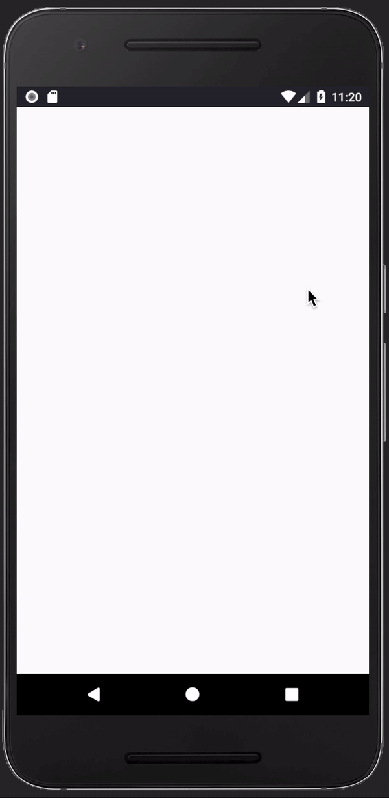

# Montage for Android
Montage helps designers and developers test out their ideas.

[](https://travis-ci.com/asadmansr/montage-android)

### Introduction
Montage is an Android application that creates and saves random user generated information for designers and developers to test their ideas. This could be the user's contact information, specific application's functionality and images.

Montage is built with Kotlin along side with the Android SDK using the MVVM Android architecture. Currently, the application randomly generates:

```
- User Picture
- Full Name
```

### Development
Montage is currently under development. Feel free to keep an eye out for any ongoing work under the [repository's issue](https://github.com/asadmansr/montage-android/issues).


